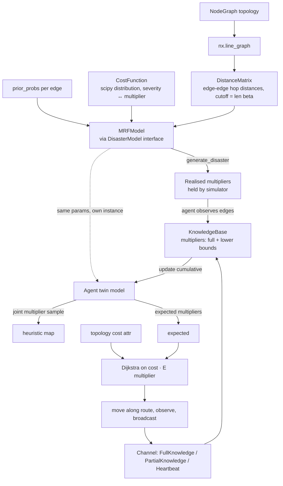

# Architecture

## Data flow

## Modules
- **`typedefs.py`** — single source of shared types. `KnowledgeBase` and `Observation`
  are dataclasses; `StateDistribution` and `LogStateWeights` are `NewType`s over `dict[State, float]`.
- **`cost_function.py`** — `CostFunction(distribution)`: any scipy frozen distribution
  (built-in, or a custom `rv_continuous` with only `_pdf`), conditioned on `m ≥ 1`. Severity
  `s ∈ [0, 1]` is the quantile in that conditioned distribution. `multiplier(s)` (ppf,
  vectorised) and `severity(m)` (cdf) are monotone inverses, each computed from the
  distribution alone; no states, no rng. No built-in default: `main.py` passes
  `stats.lognorm(s=1)` (upper half of lognormal(0, 1), median 1). A custom `rv_continuous` with only `_pdf` is slow (numeric cdf/ppf: ~4 s
  for the 40×40 cache); define `_cdf`/`_ppf` on it when possible.
- **`disaster_model.py`** — `DisasterModel` (ABC, `slots=True`): the **only** interface
  `Agent`/`Stellar` use. Speaks cost multipliers: `generate_disaster() -> CostScenario`,
  `update(kb) -> (CostScenario, ExpectedMultipliers)`, `expected_multiplier(edge)`, `sample()`.
  No notion of states, so a non-discrete model (e.g. Gaussian MRF) can implement it.
- **`discrete_model.py`**
  - `DiscreteStateModel(DisasterModel)`: priors over states, `cost_function`, the
    `(edge, state)` multiplier cache, samplers. State 0 = multiplier 1; damaged state k owns
    severity band `[(k-1)/n, k/n]`. All state logic sits here on top of the cost function:
    cache draw `s ~ U(band)` → `multiplier(s)` (with `multiplier_rng`), `_inverse(m)` (band of
    `severity(m)`), `state_log_likelihood(state, lower)`, `_sample_at_least(state, lower)`.
    Posterior scenario/beliefs → multipliers / mean multipliers. Subclasses implement
    `generate_states()`, `prior_run()`, `update_states(full, lower)`, `sample_states(full, lower)`.
  - `MRFModel(DiscreteStateModel)`: precomputes neighbours within cutoff, log-priors and prior
    means as arrays, a sparse coupling matrix (row e = `β[d-1]/|N(e)|` per neighbour, so
    `coupling @ (x − μ)` gives every edge's mean deviation) and a greedy colouring of the
    coupling graph. A sweep resamples one colour class at a time, vectorised with Gumbel-max
    (edges of one colour are conditionally independent, so this is exact Gibbs); `_run_gibbs` does cold start (`n_iter`, `burn_in`) or warm start from `_last_state`
    (`warm_iter`, no burn-in). `_cold_run` serves `generate_states`, `prior_run` and
    chain-less `sample_states` without touching the update chain.
- **`edges.py`** — `canonical(u, v)` and `canonical_line_graph(graph)`.
- **`message.py`** — immutable, slotted message dataclasses; `ALL` sentinel is a `StrEnum` member.
- **`channel.py`** — `Channel` protocol (`send`, `deliver`) and `BroadcastChannel` (lossless,
  delivers at the next tick, resolves `ALL`/target sets, never back to the sender).
- **`scenario_generator.py`**
  - `Agent`: position `(entry, far, heading, pos)` or a node; `reach[edge][end]` memory. A tick
    moves it event by event: reaching an end, the explored stretches meeting (exact
    observation, `(reach_u + reach_v)·speed/c_e`) and going overdue (lower bound from the same
    sum). New knowledge → one `twin_model.update(kb)` → reroute (Dijkstra on estimated
    times; mid-edge back-vs-forward choice). Observations are queued as messages.
  - `Stellar`: draws the truth (`generate_disaster`), gives each agent its true crossing times
    (used only to detect reaching a point), and loops ticks: deliver → ingest/replan → step →
    send. Returns `RunResult`.
- **`main.py`** — demo/plotting only; not a library entry point.

## Invariants
- Every `Edge` is canonical `(min(u, v), max(u, v))`. The model's edge set/ordering is
  `prior_probs.keys()`, built from `canonical_line_graph(graph).nodes`. `DiscreteStateModel`
  rejects non-canonical priors and unknown observed edges (`ValueError`); `Agent` and
  the knowledge payloads canonicalise what they receive.
- `update()` must receive **all** observations so far; clamping only the newest lets old ones drift.
- Observations are **multipliers**: full = exact, partial = lower bound. Base costs live only on
  the topology (`graph[u][v]["cost"]`); models never see them.
- Each model instance draws its own multiplier cache, so a discrete model clamps an observed
  edge by inverting its multiplier to a state, and reports the observed value (not its cache)
  for that edge in `update`/`expected_multiplier`/`sample`.
- `expected_multiplier`/`sample` reflect the latest `update`. Before any update they use the
  model's **own marginals** (`prior_run()`, computed lazily once; the first pre-update `sample()` reuses that same cold run), not raw `prior_probs` —
  temperature and coupling make the two differ.
- Only `update_states` creates/keeps the Gibbs chain (`_last_state`). Generation, prior
  marginals and `sample()` before any update run cold and leave it untouched, so the first
  real update is always a cold run; later updates and `sample()` warm-start.
- Partial observations: every still-possible state whose multiplier is below the bound is
  redrawn above it (`_conditioned`, separate from the cache), so expected and sampled
  multipliers never fall below an observed lower bound. `generate_disaster` uses the raw cache.
- Full observations are clamped (belief = one-hot); partial observations remove impossible
  states (`log_likelihood == NEG_INF`) from the candidate set.
- All randomness is injected: `rng` drives state sampling (Gibbs seeds a numpy Generator from
  `rng.getrandbits(64)` per run), `multiplier_rng` drives
  multiplier draws (cache and lower-bound redraws). The cost function is deterministic.
- Sampling only runs forward (state → severity → multiplier); observing only backward
  (multiplier → severity → state). Neither direction needs the other.

## Performance notes
- `DistanceMatrix` is computed with `single_source_shortest_path_length(..., cutoff=len(BETA))`
  — never all-pairs (quadratic in edge count).
- One Gibbs sweep is O(|E| · avg neighbours · K), done as one numpy step per colour class.
  On the 40×40 grid (3120 edges): cold run (1000 sweeps) ≈ 0.6 s, warm update ≈ 0.04 s; a
  3-agent simulation ≈ 16 s. The pure-Python sweep it replaced was ~20× slower; its marginals
  match the vectorised ones within Monte Carlo noise.
